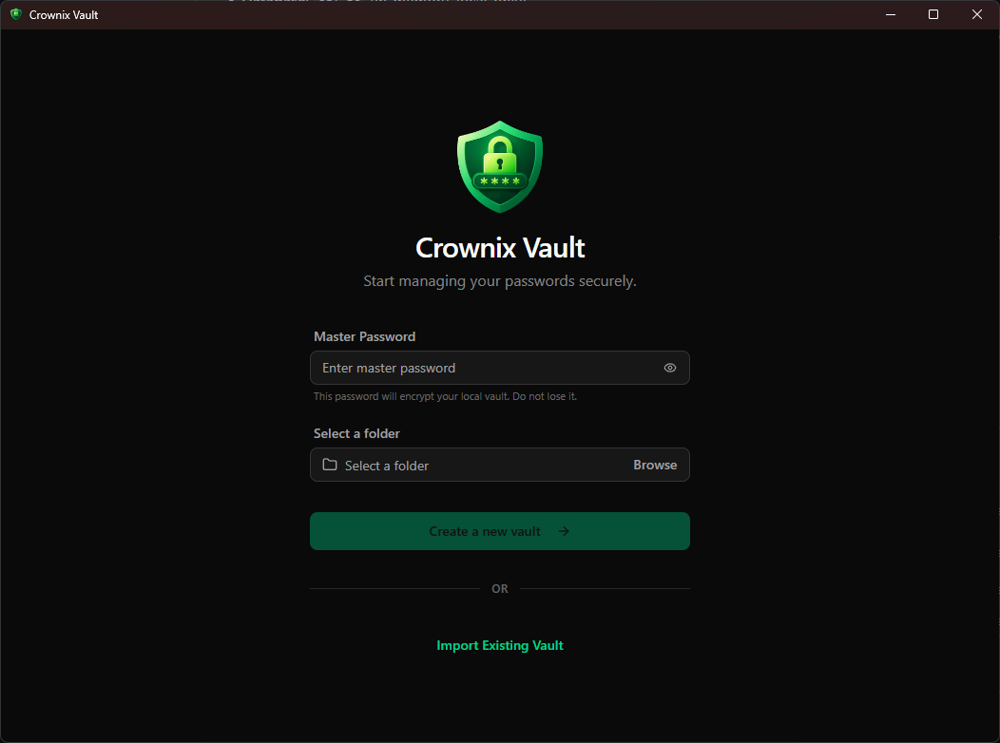
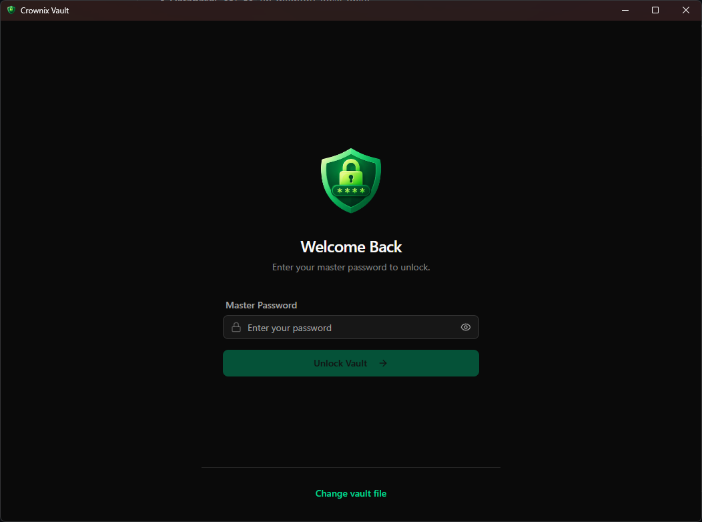
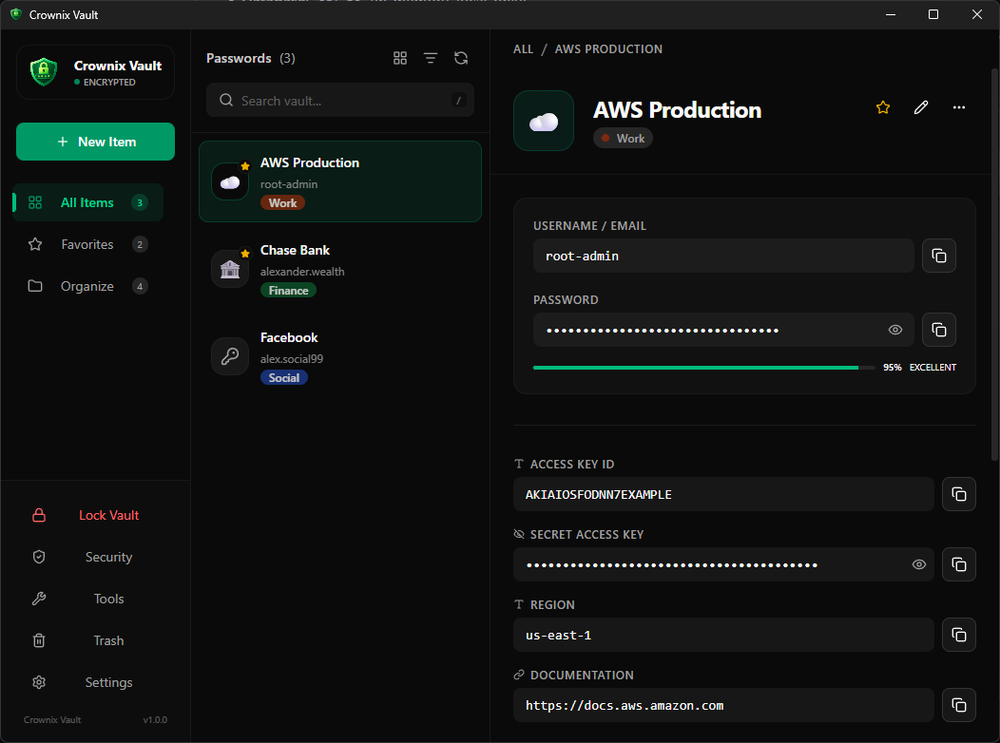
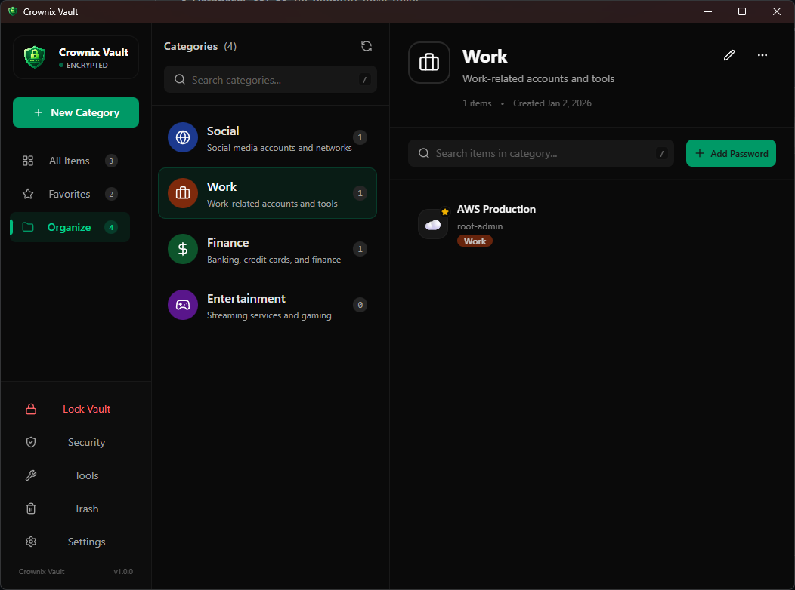
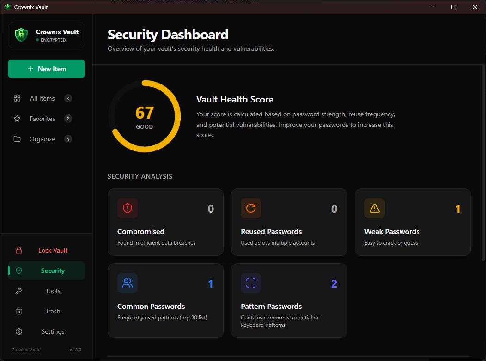
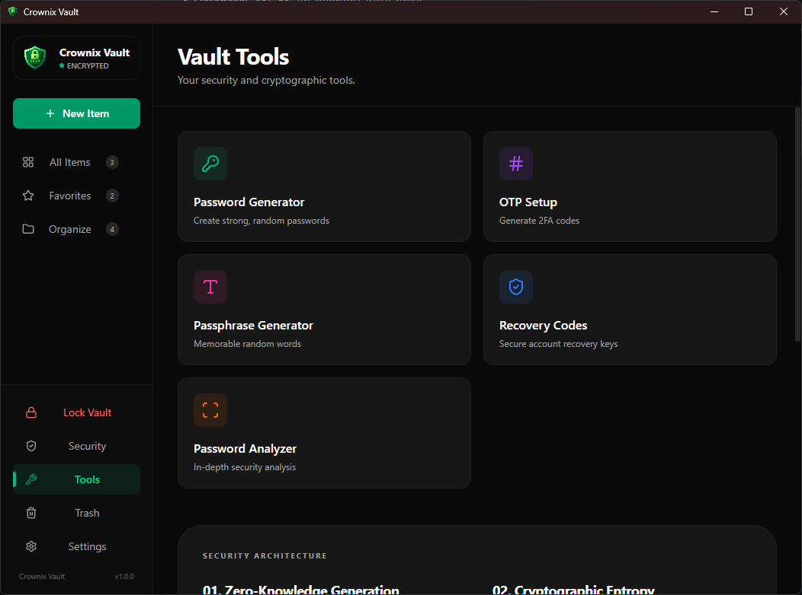
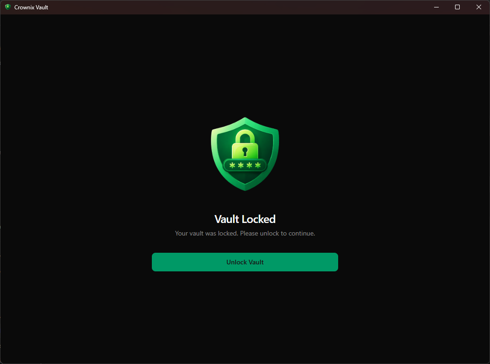

  <h1>Crownix Vault</h1>
  

    <strong>Local-first password manager for Windows.</strong> 
    Secure. Private. Yours.
  

  

    <a href="https://github.com/tsgamage/crownix-vault-releases/releases"><strong>Download</strong></a> ·
    <a href="/README.md#screenshots"><strong>Screenshots</strong></a> ·
    <a href="https://github.com/tsgamage/crownix-vault-releases/issues">Report an Issue</a>
  

  
  
  

---

## About

**Crownix Vault** is a modern, local-first password manager designed for users who value privacy, transparency, and control.

Unlike cloud-based password managers, Crownix Vault stores all data **locally** in an encrypted vault file. Your passwords never leave your device, and no account, sync service, or server is required.

The application is built using **Tauri**, **Rust**, and **React**, combining strong security guarantees with a fast, lightweight desktop experience.

This repository contains **official release builds only**.  
The source code is maintained separately.

---

## Platform Support

- **Windows**: Supported (current)
- **Android**: Planned (future)

At this time, Crownix Vault is officially available **only for Windows**.

---

## Key Features

- **Local-first architecture**  
  All data is stored locally in an encrypted vault file. No cloud, no tracking, no telemetry.

- **Strong encryption**  
  Vault data is encrypted using AES-256-GCM.  
  Encryption keys are derived from your master password using PBKDF2 (SHA-256, 200,000 iterations).

- **Zero-knowledge design**  
  Your master password is never stored. Only you can unlock your vault.

- **Advanced password generator**  
  Generates high-entropy passwords with fine-grained control and pattern avoidance.

- **Vault health analysis**  
  Detects weak, reused, common, and pattern-based passwords to help improve overall security.

- **Auto-lock & clipboard protection**  
  Automatically locks the vault when idle and clears copied passwords after a timeout.

- **Portable vault file**  
  Your vault is a single encrypted file that you fully own and control.

---

## Downloads

All official builds are available on the **Releases** page:

👉 https://github.com/tsgamage/crownix-vault-releases/releases

### Windows

- `.msi` installer (recommended)
- Portable `.exe`

Checksums are provided with each release.

---

## Security Notes

Crownix Vault is designed with security as a primary goal, but it is still **v1.0.0**.

- The vault format is custom and encrypted.
- No data is sent over the network.
- Automatic updates are **not enabled yet**.
- Manual updates are required by downloading new releases.

If you discover a security issue, please report it responsibly via GitHub Issues.

---

## Roadmap (High-level)

- Automatic updates
- Android support
- Optional vault backups and restore improvements
- UI and accessibility refinements

The roadmap may change based on feedback and testing.

---

## Feedback & Issues

This is the first public release.

If you encounter bugs, crashes, or unexpected behavior, please open an issue here:
https://github.com/tsgamage/crownix-vault-releases/issues

Constructive feedback is always welcome.

---

## License

The application binaries are provided for personal use.  
All rights reserved.

---

## Screenshots

  
  
  
  
  
  
  
  

---

  
    Crownix Vault · Built by Crownix
  

